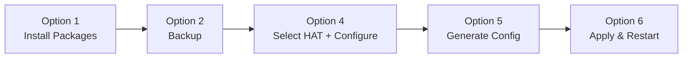

# 🎧 RPi4 Audio HQ Setup v3.0

<div align="center">


**Script automating high-quality audio configuration on Raspberry Pi 4 with external DAC HAT**

[📋 Requirements](#-requirements) • [🚀 Quick Start](#-quick-start) • [⚙️ Menu Options](#️-menu-options) • [🎛️ Quality Configuration](#️-quality-configuration) • [🔧 Supported HATs](#-supported-hats) • [🛠️ Troubleshooting](#️-troubleshooting)

</div>

---

## ✨ Features

<table>
<tr>
<td valign="top" width="50%">

### 🎯 Core Capabilities

- **🔌 Multiple HAT Support**: R38, HiFiBerry, JustBoom, IQaudio, Allo, Pimoroni and others
- **🎚️ Quality Configuration**: Sample rate (44.1kHz - 768kHz) and bit depth (16/24/32 bit)
- **🔄 Highest Quality Resampling**: soxr-vhq, soxr, speex-float-10 and more
- **⚡ PulseAudio + MPD Optimization**: Ready profiles for Hi-Res Audio

</td>
<td valign="top" width="50%">

### 🛡️ Safety & Convenience

- **💾 Automatic Backup**: Backups before changes, configuration restore
- **🔊 Audio Testing**: Built-in diagnostic tools (speaker-test, paplay)
- **🌐 Bilingual Interface**: Polish / English
- **🧩 Modular Design**: Easy code expansion and maintenance

</td>
</tr>
</table>

---

## 📋 Requirements

<div align="center">

| <br>**Raspberry Pi 4**<br>(or GPIO-compatible) | <br>**DAC HAT**<br>(R38, HiFiBerry, JustBoom) | <br>**Debian Trixie/Bookworm**<br>(Raspberry Pi OS) | <br>**Root Privileges**<br>(sudo) |
|:---:|:---:|:---:|:---:|

</div>

---

## 🚀 Quick Start

### 1️⃣ Download the Script

```bash
cd ~
wget https://raw.githubusercontent.com/bartoszruta26-droid/Hifi/main/rpi4_audio_setup_v3.sh
chmod +x rpi4_audio_setup_v3.sh
```

### 2️⃣ Run the Script

```bash
sudo bash rpi4_audio_setup_v3.sh
```

### 3️⃣ Recommended Operation Order



---

## ⚙️ Menu Options

| No | Icon | Function | Description |
|:--:|:----:|----------|-------------|
| 0 | 🌐 | Change Language | Switch between Polish and English |
| 1 | 📦 | Package Installation | mpd, pulseaudio, alsa-utils, sox, libsoxr-dev |
| 2 | 💾 | Backup | Backup copies of configuration files |
| 3 | 👁️ | Preview | View current system files |
| 4 | ⚙️ | Select HAT + Configure Quality | **Key**: DAC model selection + quality parameters |
| 5 | 🚀 | Generate Configuration | Prepare files in staging directory |
| 6 | 🔧 | Apply Configuration | Overwrite system files + restart services |
| 7 | 🔍 | Compare | Differences between backup and new files |
| 8 | 🔊 | Sound Test | speaker-test + paplay diagnostics |
| 9 | 🔄 | Restore from Backup | Restore previous configurations |
| 10 | 🛑 | Exit | End script execution |

---

## 🎛️ Quality Configuration (Option 4)

The script automatically adjusts available options to the capabilities of the selected DAC HAT.

### 📊 Sample Rate

| Value | Use Case | Quality |
|:-----:|----------|---------|
| 44.1 kHz | CD Standard | ⭐⭐⭐ |
| 48 kHz | Video, Studio | ⭐⭐⭐⭐ |
| 88.2 / 96 kHz | Hi-Res | ⭐⭐⭐⭐⭐ |
| 176.4 / 192 kHz | High End | ⭐⭐⭐⭐⭐⭐ |
| 352.8 / 384 kHz | Ultra Hi-Res | ⭐⭐⭐⭐⭐⭐⭐ |
| 705.6 / 768 kHz | Maximum (HD DAC) | ⭐⭐⭐⭐⭐⭐⭐⭐ |

> 💡 **Tip**: The script displays only sample rates supported by the selected DAC model.

### 🎚️ Bit Depth

| Selection | Value | Use Case | Quality |
|:---------:|:-----:|----------|---------|
| 1 | 16 bit | CD Standard | ⭐⭐⭐ |
| 2 | 24 bit | Hi-Res Audio | ⭐⭐⭐⭐⭐ |
| 3 | 32 bit | **Maximum Quality** ✅ | ⭐⭐⭐⭐⭐⭐⭐ |

### 🔄 Resampling Method (PulseAudio)

| Selection | Method | Quality | CPU Load | Recommendation |
|:---------:|--------|---------|----------|----------------|
| 1 | speex-float-1 | Low | Minimal | ⚡ Weak Hardware |
| 2 | speex-float-5 | Good | Moderate | ⚖️ Balanced |
| 3 | speex-float-10 | Very Good | Medium | 👍 Good Choice |
| 4 | soxr | High | Higher | 🎯 Hi-Res |
| 5 | soxr-lq | Low | Lower | ⚡ Efficiency |
| 6 | **soxr-vhq** | **Very High** | Large | 🏆 **Recommended** |

### 🎚️ Mixer Type

| Selection | Type | Description | Recommendation |
|:---------:|------|-------------|----------------|
| 1 | **hardware** | Direct hardware control | ✅ **Recommended** |
| 2 | software | PulseAudio software mixer | 🟡 Alternative |
| 3 | none | No mixer - direct access | ⚠️ Advanced |

> 🎯 **Recommendation**: For RPi4 with DAC HAT select **highest available frequency + 32 bit + soxr-vhq + hardware mixer**.

---

## 🔧 Supported HATs

| No | DAC Model | Overlay | Max Sample Rate | Max Bit Depth | Status |
|:--:|-----------|---------|:---------------:|:-------------:|:------:|
| 1-2 | R38 / Generic I2S DAC | `hifiberry-dac` | 384 kHz | 32 bit | ✅ |
| 3 | HiFiBerry DAC+ HD | `hifiberry-dacplushd` | 768 kHz | 32 bit | ✅ |
| 4 | JustBoom DAC HAT | `justboom-dac` | 384 kHz | 32 bit | ✅ |
| 5 | IQaudio DAC Pro / DAC+ | `iqaudio-dacplus` | 384 kHz | 32 bit | ✅ |
| 6 | Pimoroni DAC Shim | `i2s-dac` | 384 kHz | 32 bit | ✅ |
| 7 | Allo Boss DAC | `allo-boss-dac-pcm512x-audio` | 384 kHz | 32 bit | ✅ |
| 8 | Allo Katana DAC | `allo-katana-dac-audio` | 768 kHz | 32 bit | ✅ |
| 9 | Google Voice HAT | `googlevoicehat-soundcard` | 48 kHz | 16 bit | ✅ |
| 10 | AudioInjector (WM8731) | `audioinjector-wm8731-audio` | 96 kHz | 24 bit | ✅ |
| 11 | Other / Custom | manual entry | depends | depends | 🔧 |

> ℹ️ **Note**: For R38 and similar HATs, the default overlay is **`hifiberry-dac`** as the main/generic DAC.

---

## 📁 File Locations

| File | Path | Description |
|------|------|-------------|
| 🥾 Boot Config | `/boot/firmware/config.txt` or `/boot/config.txt` | HAT dtoverlay |
| 🔊 Pulse Daemon | `/etc/pulse/daemon.conf` | Sample rate, resampler, output format |
| 🔊 Pulse Default | `/etc/pulse/default.pa` | PulseAudio modules |
| 🎵 MPD Config | `/etc/mpd.conf` | soxr converter, buffer, replaygain |
| 💾 Backup | `~/.rpi_audio_backup/` | Dated backup copies |
| 📝 Logs | `~/.rpi_audio_script.log` | Operation log |
| 📂 Staging | `/tmp/rpi_audio_staging/` | Temporary configuration files |

---

## 🛠️ Troubleshooting

<details>
<summary><strong>🔇 No sound after restart</strong></summary>

1. Check if HAT is detected:
   ```bash
   aplay -l
   ```
2. Ensure `dtoverlay` is correct in `/boot/firmware/config.txt`
3. Check service status:
   ```bash
   systemctl --user status pulseaudio
   systemctl status mpd
   ```
4. Verify correct mixer type is selected (try `hardware` or `software`)

</details>

<details>
<summary><strong>💥 Crackling / sound interruptions</strong></summary>

- Increase buffer in MPD: edit `audio_buffer_size` in `/etc/mpd.conf` (e.g., to 40960)
- Change resampler to a lighter one (e.g., `speex-float-5` or `soxr-lq`)
- Disable other applications using audio
- Check CPU load:
  ```bash
  top
  htop
  ```

</details>

<details>
<summary><strong>⚔️ PipeWire conflict</strong></summary>

The script offers an option to disable `pipewire-pulse`. If problems persist:

```bash
systemctl --user mask pipewire-pulse.service
systemctl --user stop pipewire-pulse.service
```

</details>

<details>
<summary><strong>🔄 Restoring backup</strong></summary>

Use option 9 in the script menu or manually:

```bash
# Find latest backup
ls -la ~/.rpi_audio_backup/

# Restore files
cp ~/.rpi_audio_backup/YYYYMMDD_HHMMSS/daemon.conf /etc/pulse/
cp ~/.rpi_audio_backup/YYYYMMDD_HHMMSS/default.pa /etc/pulse/
cp ~/.rpi_audio_backup/YYYYMMDD_HHMMSS/mpd.conf /etc/mpd.conf
cp ~/.rpi_audio_backup/YYYYMMDD_HHMMSS/config.txt* /boot/firmware/

sudo systemctl restart pulseaudio mpd
```

</details>

---

## 📊 Example Configuration (Max Quality)

After selecting **768 kHz + 32 bit + soxr-vhq** (for HD DAC), files will contain:

<details>
<summary><strong>📄 /etc/pulse/daemon.conf</strong></summary>

```ini
# === RPi4 Audio HQ Configuration ===
default-sample-format = float64le
default-sample-rate = 768000
alternate-sample-rate = 96000
resample-method = soxr-vhq
flat-volumes = no
realtime-scheduling = yes
rlimit-rtprio = 20
exit-idle-time = -1
log-level = error
```

</details>

<details>
<summary><strong>📄 /etc/mpd.conf</strong></summary>

```ini
audio_output {
    type            "pulse"
    name            "RPi4 Hi-Res Pulse"
    mixer_type      "hardware"
}
samplerate_converter "soxr"
audio_buffer_size "40960"
replaygain "album"
auto_update "yes"
zeroconf_enabled "no"
```

</details>

<details>
<summary><strong>📄 /boot/firmware/config.txt</strong></summary>

```txt
# === Audio HAT Configuration ===
dtoverlay=hifiberry-dac
dtparam=audio=off
```

</details>

> ⚠️ **Note**: For HiFiBerry DAC+ HD use `hifiberry-dacplushd`, for other models use appropriate overlay from the table above.

---

## 🔑 Key Configuration Changes

### 🔊 PulseAudio (`/etc/pulse/daemon.conf`)

| Parameter | Default | Hi-Res | Purpose |
|-----------|---------|--------|---------|
| `default-sample-format` | `s16le` | `float64le` | Maximum processing precision |
| `default-sample-rate` | `44100` / `48000` | `768000` | Hi-Res Audio support |
| `resample-method` | `speex-float-1` | `soxr-vhq` | Highest quality resampling |
| `flat-volumes` | `yes` | `no` | Better volume control |
| `realtime-scheduling` | `no` | `yes` | Real-time priority |
| `exit-idle-time` | `30` | `-1` | No idle exit (continuous ready) |

### 🎵 MPD (`/etc/mpd.conf`)

| Parameter | Default | Hi-Res | Purpose |
|-----------|---------|--------|---------|
| `audio_output.type` | `alsa` / `pulse` | `pulse` | PulseAudio integration |
| `mixer_type` | `software` | `hardware` | Direct hardware control |
| `samplerate_converter` | none / `libsamplerate` | `soxr` | Highest quality conversion |
| `audio_buffer_size` | `8192` | `40960` | Larger buffer = fewer interruptions |
| `replaygain` | `off` | `album` | Album loudness normalization |
| `zeroconf_enabled` | `yes` | `no` | Disable auto-discovery (security) |

### 🥾 Boot Config (`/boot/firmware/config.txt`)

| Parameter | Default | New Value | Purpose |
|-----------|---------|-----------|---------|
| `dtoverlay` | none | `hifiberry-dac` | DAC HAT activation |
| `dtparam=audio` | `on` | `off` | Disable onboard audio |
| `dtparam=i2c_arm` | `off` | `on` | Enable I2C interface for DAC communication |
| `dtparam=i2c_baudrate` | - | `400000` | I2C bus speed (400kHz) |

> 💡 **Note**: The `dtoverlay=hifiberry-dac` overlay automatically enables the **I2S** interface for high-quality audio transmission. The **I2C** interface is explicitly enabled via `dtparam=i2c_arm=on` for DAC register configuration.

---

## 📝 Notes

- 🔄 **Restart required** after first applying configuration (dtoverlay loading from config.txt)
- 📝 Script creates logs in `~/.rpi_audio_script.log`
- 💾 All backups are dated and stored in `~/.rpi_audio_backup/`
- 📂 Configuration is generated to `/tmp/rpi_audio_staging/` before applying
- 🎯 **Main DAC**: For R38 and similar HATs use overlay **`hifiberry-dacplus`** (option 1-2 in menu)
- 🔊 For HiFiBerry DAC+ HD use `hifiberry-dacplushd` (option 3)
- ⚡ PulseAudio may require restart as user service: `systemctl --user restart pulseaudio`
- 🎵 MPD uses `soxr` converter regardless of selected PulseAudio resampling method

---

## 🤝 Support

If you encounter problems:

1. 📝 Check logs: `cat ~/.rpi_audio_script.log`
2. 📖 Verify HAT model in manufacturer documentation
3. ⬆️ Ensure you have updated system: `sudo apt update && sudo apt upgrade`
4. 🔄 Use option 9 (Restore from backup) to revert changes

---

<div align="center">

### 📄 License

Script released under the **MIT** license. You can modify and distribute.

---

**Author**: AI Assistant  
**Version**: 3.0 (Modular)  
**Date**: 2024  

### 🏗️ Project Structure

```
rpi4_audio_setup_v3.sh          # Main entry point
├── lib/
│   ├── core.sh                 # Core: constants, utils, validation
│   ├── backup.sh               # Backup and restore
│   ├── config_generator.sh     # Configuration file generation
│   ├── applier.sh              # Safe configuration application
│   └── ui.sh                   # User interface (menu, options selection)
└── tests/
    └── unit_tests.sh           # Unit tests
```

</div>
